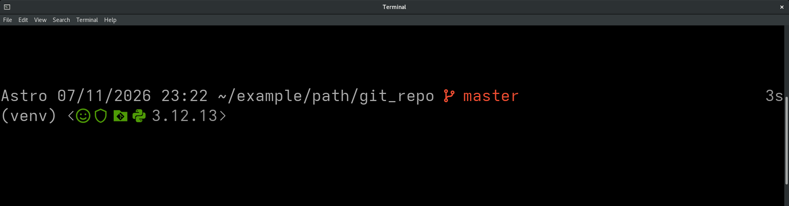
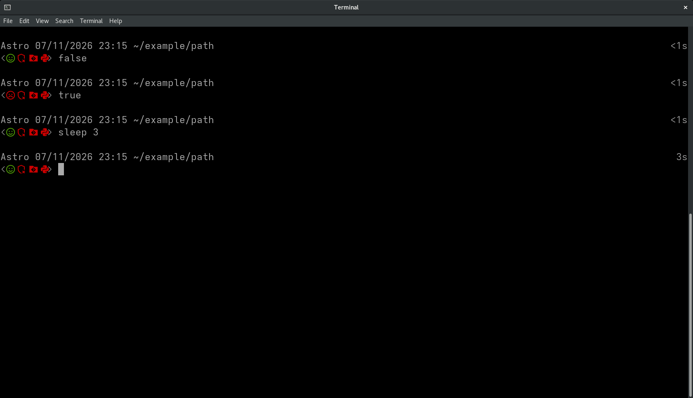
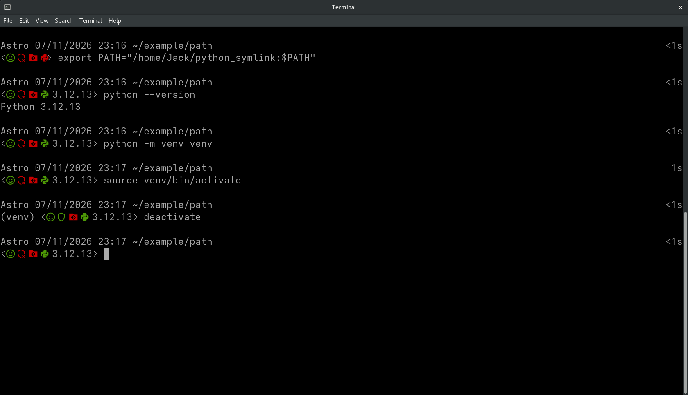
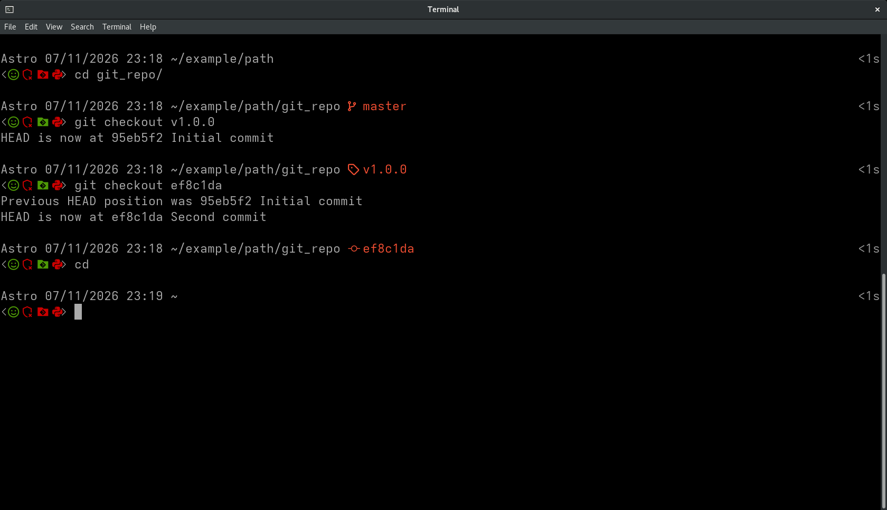
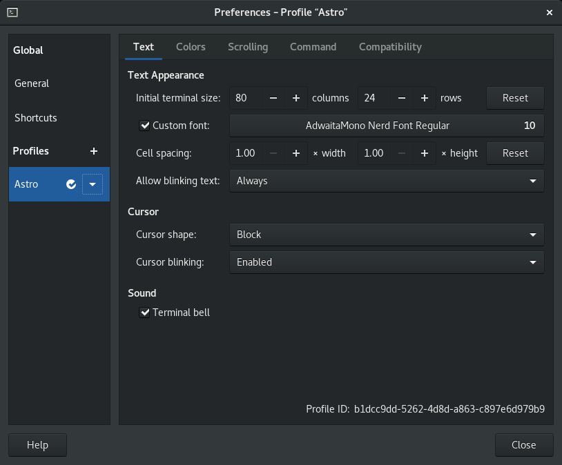

<h1 align="center">The Python Developer's .bashrc and PS1 User Prompt</h1>

<p align="center">
  A custom <code>.bashrc</code> with a two-line PS1 prompt displaying a variety of useful information for the Python developer, including status icons for Git, Python, virtual environments, exit codes, and command duration.
</p>

<p align="center">
  
</p>

<p align="center">
  <a href="#features">Features</a> &middot;
  <a href="#examples">Examples</a> &middot;
  <a href="#setup">Setup</a> &middot;
  <a href="#command-reference">Command Reference</a> &middot;
  <a href="#limitations">Limitations</a>
</p>

## Compatibility
Written with the following OS and Bash versions in mind:<br />
- Red Hat Enterprise Linux 8.10 (Ootpa)<br />
- GNU Bash, version 4.4.20(1)-release (x86\_64-redhat-linux-gnu)</p>

## Features
The user-prompt is built as two lines. The first line gives shell context - time, date, Git HEAD reference, command duration, etc., and the second line exists as a small status tray of icons - previous command exit status, is a Python venv active, etc.
<table>
  <thead>
    <tr>
      <th>Prompt Line</th>
      <th>Feature</th>
      <th>Meaning</th>
    </tr>
  </thead>
  <tbody>
    <tr>
      <td rowspan="3" align="center"><strong>Line 1</strong></td>
      <td>Shell context</td>
      <td>Username, date, time (24-hour), and current working directory.</td>
    </tr>
    <tr>
      <td>Git HEAD revision</td>
      <td>If the user is in a Git repository, the section will display the current branch name, tag, or commit hash.</td>
    </tr>
    <tr>
      <td>Command timer</td>
      <td>Displays time duration of the previous user command, right-aligned.</td>
    </tr>
    <tr>
      <td rowspan="5" align="center"><strong>Line 2</strong></td>
      <td>Virtual environment name</td>
      <td>Name of active Python virtual environment, based on the <code>VIRTUAL_ENV</code> bash variable.</td>
    </tr>
    <tr>
      <td>Smile Icon</td>
      <td>Green smile if previous command had an exit status of <code>0</code>.<br>
          Red for any other exit status.</td>
    </tr>
    <tr>
      <td>Shield Icon</td>
      <td>Green shield if a Python virtual environment is active (protected).<br>
          Red shield if no Python virtual environment is active (unprotected).<br>
          Based on whether or not <code>VIRTUAL_ENV</code> is set.</td>
    </tr>
    <tr>
      <td>Git Directory Icon</td>
      <td>Green folder with Git logo if the current directory is inside a Git work tree.<br>
          Red folder with Git logo if the current directory is not inside a Git work tree.</td>
    </tr>
    <tr>
      <td>Python Icon</td>
      <td>Green Python logo with interpreter version if <code>python</code> is available on <code>SPATH</code>.<br>
          Red Python logo if <code>python</code> is not found on <code>SPATH</code></td>
    </tr>
  </tbody>
</table>

## Examples

### Exit Status and Timer
The user-prompt displays whether the previous command succeeded (smile icon) and how long it ran (right-aligned time duration).
<p align="center">
  
</p>

### Python and Virtual Environments
The user-prompt will display a green shield or red shield with a small "x" depending on if the user is in an active virtual environment or working in an unprotected global Python context.  
If the command `python` is available (a Python interpreter by the same name exists on `PATH`), a Python logo icon will display as green and the version of the available Python interpreter will print next to it. If no Python interpreter exists on `PATH` under the name `python`, a red Python logo icon will display with no version.

<p align="center">
  
</p>

### Git HEAD Revision
If the current working directory is inside a Git work tree, a green folder with the Git logo will appear in the second row icon tray. Otherwise, a red folder with the Git logo will appear.  
Paired with this, the currently  checked out branch, tag, or commit will display in the first row with the associated glyph, if possible to determine.
<p align="center">
  
</p>

## Setup

### .bashrc
It is strongly recommended that before using this `.bashrc` or implementing any of its features, you understand fully the content already present in your `~/.bashrc` file, such as to avoid unintentionally altering any shell behavior or tool-specific configuration you rely on.

To use this `.bashrc` on your system, copy the `.bashrc` file into your home directory:

```bash
cp .bashrc ~/.bashrc
```

 Alternatively, you may pick and choose what features you want and add them to your `~/.bashrc` manually, as you see fit.  

### Font

This `.bashrc` makes use of AdwaitaMono Nerd Font glyphs for the status icons.  
Every typeface for AdwaitaMono Nerd Font has been included in this repository for convenience.  
To install your preferred AdwaitaMono Nerd Font typeface, simply download the `.ttf` file and place it in the correct directory.  

On a typical Linux OS, user-installed fonts can be placed under:

```text
~/.local/share/fonts/
```

Then, in the terminal preferences menu on the Text tab, you may select your preferred AdwaitaMono Nerd Font typeface for the "Custom font" option:




## Command Reference
This `.bashrc` exposes a small variety of useful command-line functions.

| Command | Type | Description |
|---|---|---|
| `ll` | Alias | `ls -l --almost-all --file-type` |
| `grep` | Alias | `grep='grep --color=auto'` |
| `diff` | Alias | `diff='diff --color=auto'` |
| `fstr SEARCH_STRING` | Function | Recursively searches for whole-word matches under the current directory and within files. |
| `path` | Function | Prints `PATH` with one line per component. |
| `groot` | Function | Changes directory to the root of the current Git repository if possible. Intentionally fails loudly if user is not in a Git repository |
| `sizes` | Function | Prints human-readable disk usage for all items in the current directory from largest to smallest, including hidden items. Does not include the "special directory entries" `.` and `..`. Runs in a subshell. |
| `systembarf` | Function | Prints output from a variety of system information commands. |

<details>
  <summary><code>fstr</code> matching behavior</summary>

```bash
fstr cat
```

Would match:

```text
cat
the cat sat
cat-dog
dog-cat
cat.dog
cat/dog
(cat)
cat!
```

Would not match:

```text
concatenate
bobcat
catfish
cat_dog
dog_cat
cat1
1cat
Cat
```

</details>

<details>
  <summary><code>path</code> example output</summary>

If `PATH` is:

```text
/usr/local/bin:/usr/local/sbin:/usr/bin:/usr/sbin:/home/<username>/.local/bin
```

Then `path` prints:

```text
/usr/local/bin
/usr/local/sbin
/usr/bin
/usr/sbin
/home/<username>/.local/bin
```

</details>

<details>
  <summary><code>systembarf</code> command calls</summary>

```text
whoami
id
hostnamectl
cat /etc/os-release
uptime
timedatectl
uname --all
lscpu
free --human
lsblk
df --human-readable
lspci
lsusb
```

</details>

## Limitations
- Fully overrides the `PROMPT_COMMAND` variable to install the custom PS1 user-prompt. Anything else installing `PROMPT_COMMAND` hooks (e.g. `direnv`) will be ignored. Any additional functionality desired must be added manually.
- The `\` character is not guarded against. If `\` shows up in the PS1 variable, strange or unexpected behavior may ensue (e.g. If the CWD is `'/tmp/demo-\n-next'`, a newline may render in the user-prompt)